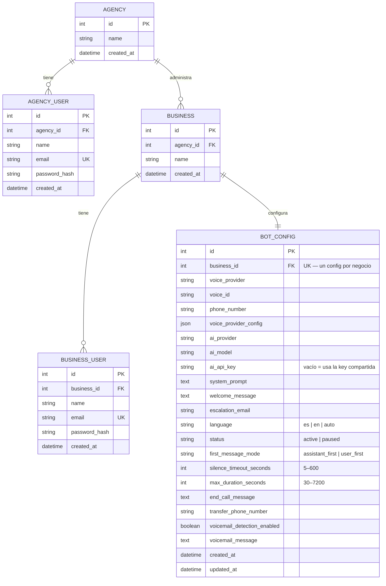

# Vox54 (nombre provisorio — pendiente de decidir el nombre real)

Plataforma de gestión multiempresa para agentes de voz — panel de agencia (nosotros)
y panel de negocio (cada cliente), con proveedor de voz y proveedor de IA
intercambiables por negocio.

## Arquitectura

- **Backend:** Python + FastAPI + SQLAlchemy (SQLite en desarrollo, migrable a
  Postgres/MySQL sin tocar código). JWT para auth, dos roles separados
  (`agency` / `business`), cada uno con sus propios endpoints protegidos.
- **Frontend:** React + Vite, sin framework de estilos — colores y tipografía
  tomados de `PROYECTO-SOL/2026/sops/plataforma/design-system-reportes-g54.html`
  (paleta real de G54: `#2D5BFF` / `#1E45D6`). El logo dice "Vox", no "Growth" —
  mismo estilo visual que la familia de productos, nombre propio.
- **El motor de voz en tiempo real (VAPI u otro) NO vive acá** — esta plataforma
  es la capa de configuración/gestión. La llamada real de audio la maneja el
  proveedor externo; nosotros guardamos qué proveedor y qué modelo de IA usa
  cada negocio.
- **Catálogo de proveedores** (`backend/app/catalog.py`): lista real de modelos
  de IA por proveedor (Groq, OpenAI, Anthropic, Gemini) y voces de muestra por
  proveedor de voz — alimenta los desplegables en cascada del formulario de
  configuración. Las voces son de muestra a propósito (etiquetadas como tal) —
  no hay ningún proveedor de voz conectado todavía, así que no se simula un
  catálogo real.

## Modelo de datos



**Reglas reales, no solo forma:** `AGENCY_USER.email` y `BUSINESS_USER.email` son
únicos a nivel global (no solo por agencia/negocio) — el login resuelve el rol
por qué tabla matchea el email, así que un mismo correo no puede repetirse
entre las dos tablas. `BOT_CONFIG.business_id` es único (`uselist=False` del
lado de SQLAlchemy) — cada negocio tiene exactamente un config, nunca cero
ni más de uno; se crea junto con el negocio en `create_business`, nunca por
separado. Borrar un `BUSINESS` en cascada borra su `BOT_CONFIG` y sus
`BUSINESS_USER` (`cascade="all, delete-orphan"`) — aunque hoy no existe
ningún endpoint que borre un negocio, así que esta cascada nunca se ejercitó
en producción.

`BotConfig` agrupa 4 responsabilidades reales: **voz** (proveedor + voz +
teléfono asignado), **IA** (proveedor + modelo + API key propia opcional),
**comportamiento** (prompt, saludo, idioma, correo de escalación, activo/pausado),
y **control de la llamada** (quién habla primero, cortes por silencio/duración,
mensaje de despedida, transferencia a un humano, detección de buzón de voz) —
este último grupo se agregó tras investigar cómo lo resuelven VAPI/Retell/Bland:
son campos de configuración real y editable hoy, aunque ningún proveedor de
voz esté conectado todavía (no se inventa ningún dato de llamadas reales,
solo la config que un negocio ya puede dejar lista de antemano).

### Validación server-side (`app/validators.py`)

El frontend ya arma cascadas proveedor→modelo y proveedor→voz, pero eso es
solo cortesía de UI — un cliente de API directo puede mandar cualquier
combinación. `validate_bot_config()` corre siempre, del lado del servidor,
sobre el objeto **ya mezclado** (config existente en la base + el patch
parcial que llegó) — nunca sobre el patch solo, porque un `PUT` parcial
puede mandar solo `ai_model` sin `ai_provider`, y hay que validar contra el
proveedor que YA está guardado en ese caso. Valida: que el modelo de IA
pertenezca al proveedor elegido, que la voz pertenezca al proveedor de voz
elegido, que `language`/`status`/`first_message_mode` sean valores reales del
catálogo, formato de `escalation_email` (vía `email-validator`), formato de
`phone_number`/`transfer_phone_number` (7–15 dígitos, admite `+`/espacios/
guiones), rangos de `silence_timeout_seconds`/`max_duration_seconds`, y
límites de longitud en los campos de texto libre. Si algo no calza, devuelve
`422` con `{"errors": [...]}` — una lista, no un solo mensaje, para que el
cliente pueda mostrar todos los problemas de una vez. `BusinessCreate`
(alta de negocio nuevo) valida aparte, a nivel de schema de Pydantic: nombre
y nombre de contacto no vacíos, contraseña de al menos 8 caracteres.

## Correr en local

### Backend

```bash
cd vox54/backend
python -m venv venv
./venv/Scripts/python.exe -m pip install -r requirements.txt
cp .env.example .env   # editar JWT_SECRET antes de producción
./venv/Scripts/python.exe seed.py   # crea datos de prueba (solo la primera vez)
./venv/Scripts/python.exe -m uvicorn app.main:app --port 8000
```

Credenciales de prueba creadas por `seed.py`:
- Agencia: `admin@growth54.com` / `agencia123`
- Negocio 1 (Crating Express): `admin@cratingexpress-demo.com` / `negocio123`
- Negocio 2 (Orison Managua): `admin@orison-demo.com` / `negocio123`

Docs interactivas de la API: `http://localhost:8000/docs`

### Frontend

```bash
cd vox54/frontend
npm install
npm run dev
```

Abre en `http://localhost:5173` — redirige a `/agencia/login` por defecto.
El negocio entra por `/negocio/login`.

## Estado actual

- [x] Login de agencia y de negocio, con JWT y roles separados
- [x] Panel de agencia — lista de negocios, crear negocio nuevo (formulario real,
      confirmado creando uno de punta a punta), entrar al detalle de cualquiera
      de los suyos para ver/editar su configuración completa
- [x] Panel de negocio — formulario completo del agente: proveedor de voz + voz
      (desplegable en cascada), teléfono asignado, proveedor de IA + modelo
      (desplegable en cascada), API key propia opcional, idioma, mensaje de
      bienvenida, correo de escalación, prompt del sistema, estado activo/pausado,
      y control de la llamada (quién habla primero, cortes por silencio/duración,
      mensaje de despedida, transferencia a un humano, detección de buzón de voz)
      — todo confirmado que persiste de verdad en la base, no solo en pantalla
- [x] Catálogo de proveedores real (`GET /catalog`), no hardcodeado en el frontend
- [x] Validación server-side de `BotConfig` (coherencia proveedor↔modelo/voz,
      formato de email/teléfono, rangos numéricos, límites de longitud) y de
      `BusinessCreate` (contraseña mínima, nombres no vacíos) — confirmada con
      9 casos reales contra el servidor corriendo (válidos e inválidos)
- [x] Guardia de sesión cruzada en el frontend (`useRequireRole`) — visitar la
      ruta del rol equivocado redirige, en vez de quedarse cargando para siempre
- [ ] Conexión real con un proveedor de voz (VAPI u otro) — hoy todo el flujo de
      configuración está listo, pero no dispara ninguna llamada real
- [ ] Borrar un negocio (no existe el endpoint todavía — fuera de alcance hasta
      que se pida)
- [ ] Medición de uso (minutos, llamadas, costo real vs. precio) y registro de
      llamadas (transcripción, grabación, motivo de fin) — deliberadamente NO
      construido todavía: sin ningún proveedor de voz conectado, cualquier
      pantalla de "llamadas" mostraría datos inventados. Es el bloqueo real de
      P0 según la investigación de competidores (ver abajo) — depende de que
      exista una llamada real primero.
- [ ] White-label de agencia (logo/color/subdominio propio, wallet + créditos +
      facturación Stripe) — patrón real de Synthflow (el único competidor con
      soporte nativo de agencia), pero es una feature grande y separada, no
      parte de "qué datos necesitan validación hoy"

### Investigación de plataformas competidoras (VAPI, Retell AI, Bland, Synthflow)

Antes de sumar campos nuevos se investigó cómo resuelven esto plataformas con
un objetivo parecido — qué configuran de verdad, y qué patrón de panel usan
para agencia vs. cliente. Hallazgo central: **ninguna de las 3 plataformas de
voz más grandes (VAPI, Retell, Bland) tiene soporte nativo de agencia/
sub-cuentas** — por eso existe todo un mercado de "wrappers" (Vapify, VoiceAI-
Wrapper) que le agregan esa capa encima. Eso confirma que el hueco que Vox54
ocupa (agencia + negocio nativos, desde el día 1) es real. El único que sí
tiene el patrón nativo es **Synthflow**: agencia ve todos los negocios,
revenue y márgenes; negocio ve solo lo suyo — permisos por sección (Agents /
Knowledge Base / Actions / Deployment / Calls), límites por sub-cuenta (máx.
minutos, llamadas concurrentes), y un número de teléfono que la agencia
"presta" al negocio (puede usarlo, no borrarlo) — mismo espíritu que nuestro
modelo `Agency → Business`, ya alineado con eso.

De VAPI/Retell/Bland se tomaron los campos de **control de la llamada**
recién agregados (`first_message_mode`, `silence_timeout_seconds`,
`max_duration_seconds`, `end_call_message`, `transfer_phone_number`,
`voicemail_detection_enabled/message`) — son config real, editable hoy, sin
depender de que exista una llamada real todavía. Deliberadamente **no** se
copiaron los campos más avanzados de Retell (`interruption_sensitivity`,
`responsiveness`, `backchannel`, `pronunciation_dictionary`, análisis
post-llamada con schema propio) — son ajuste fino de calidad de conversación
que solo tiene sentido una vez que el bot esté recibiendo llamadas reales de
un proveedor conectado; agregarlos ahora sería un campo más para llenar sin
ningún efecto observable.
