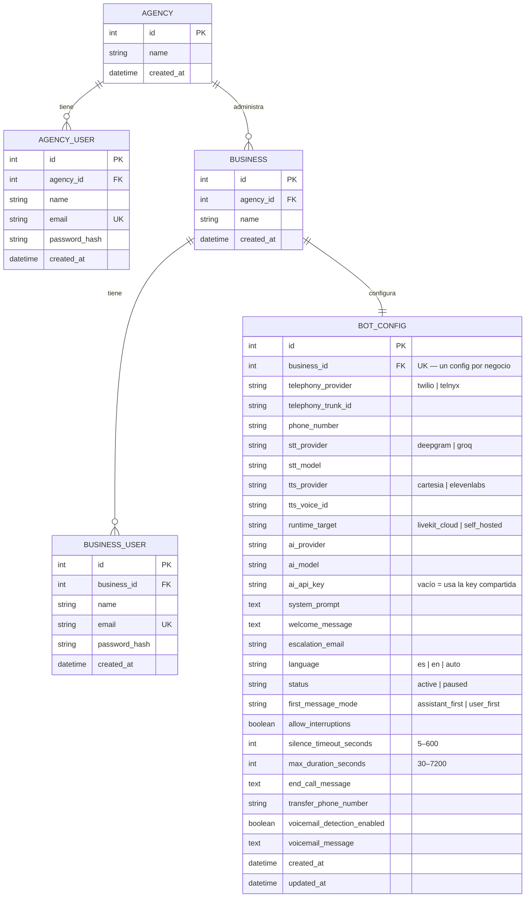

# Vox54 (nombre provisorio — pendiente de decidir el nombre real)

Plataforma de gestión multiempresa para agentes de voz — panel de agencia (nosotros)
y panel de negocio (cada cliente), con proveedor de voz y proveedor de IA
intercambiables por negocio.

## Arquitectura

- **Backend:** Python + FastAPI + SQLAlchemy (SQLite en desarrollo, migrable a
  Postgres/MySQL sin tocar código). JWT para auth, dos roles separados
  (`agency` / `business`), cada uno con sus propios endpoints protegidos.
- **Frontend:** React + Vite, sin framework de estilos — colores y tipografía
  tomados de `PROYECTO-SOL/2026/sops/plataforma/design-system-reportes-g54.html`
  (paleta real de G54: `#2D5BFF` / `#1E45D6`). El logo dice "Vox", no "Growth" —
  mismo estilo visual que la familia de productos, nombre propio.
- **No dependemos de VAPI (ni de ningún otro orquestador todo-en-uno).**
  Investigado el 2026-08-29 (ver sección de investigación abajo): el pipeline
  de la llamada en tiempo real lo corre nuestro propio **worker de LiveKit
  Agents** (`vox54/worker/`, proceso Python separado del backend), armado
  sobre proveedores intercambiables e independientes — telefonía (Twilio/
  Telnyx), reconocimiento de voz/STT (Deepgram/Groq Whisper), síntesis de voz/
  TTS (Cartesia/ElevenLabs) — más el proveedor de IA de siempre para el modelo
  que piensa las respuestas. `BotConfig` (backend) sigue siendo la única capa
  de configuración — ningún framework de código abierto investigado tiene un
  objeto de config declarativo propio, así que esa responsabilidad la
  cubrimos nosotros sea cual sea el motor de voz de abajo.
- **Catálogo de proveedores** (`backend/app/catalog.py`): lista real de modelos
  de IA/STT por proveedor (Groq, OpenAI, Anthropic, Gemini para IA; Deepgram,
  Groq Whisper para STT) y voces de muestra por proveedor de TTS — alimenta
  los desplegables en cascada del formulario de configuración. Las voces de
  TTS son de muestra a propósito (etiquetadas como tal) — no hay ninguna
  cuenta real de Cartesia/ElevenLabs conectada todavía, así que no se simula
  un catálogo real.

## Modelo de datos



**Reglas reales, no solo forma:** `AGENCY_USER.email` y `BUSINESS_USER.email` son
únicos a nivel global (no solo por agencia/negocio) — el login resuelve el rol
por qué tabla matchea el email, así que un mismo correo no puede repetirse
entre las dos tablas. `BOT_CONFIG.business_id` es único (`uselist=False` del
lado de SQLAlchemy) — cada negocio tiene exactamente un config, nunca cero
ni más de uno; se crea junto con el negocio en `create_business`, nunca por
separado. Borrar un `BUSINESS` en cascada borra su `BOT_CONFIG` y sus
`BUSINESS_USER` (`cascade="all, delete-orphan"`) — aunque hoy no existe
ningún endpoint que borre un negocio, así que esta cascada nunca se ejercitó
en producción.

`BotConfig` agrupa 6 responsabilidades reales: **telefonía** (proveedor +
trunk + teléfono + dónde corre el worker), **STT** (proveedor + modelo de
reconocimiento de voz), **TTS** (proveedor + voz de síntesis), **IA**
(proveedor + modelo + API key propia opcional), **comportamiento** (prompt,
saludo, idioma, correo de escalación, activo/pausado), y **control de la
llamada** (quién habla primero, si se puede interrumpir al agente, cortes por
silencio/duración, mensaje de despedida, transferencia a un humano, detección
de buzón de voz). Las primeras 3 categorías (telefonía/STT/TTS) reemplazaron
al viejo `voice_provider`/`voice_id` (pensado en el vocabulario de VAPI) el
2026-08-29, cuando se decidió no depender de VAPI — ver la sección de
investigación de ese día más abajo. Todo esto es config real y editable hoy,
aunque el worker todavía no haya atendido una llamada real (no se inventa
ningún dato de llamadas, solo la config que un negocio ya puede dejar lista
de antemano).

### Validación server-side (`app/validators.py`)

El frontend ya arma cascadas proveedor→modelo y proveedor→voz, pero eso es
solo cortesía de UI — un cliente de API directo puede mandar cualquier
combinación. `validate_bot_config()` corre siempre, del lado del servidor,
sobre el objeto **ya mezclado** (config existente en la base + el patch
parcial que llegó) — nunca sobre el patch solo, porque un `PUT` parcial
puede mandar solo `ai_model` sin `ai_provider`, y hay que validar contra el
proveedor que YA está guardado en ese caso. Valida: que el modelo de IA
pertenezca al proveedor elegido, que la voz pertenezca al proveedor de voz
elegido, que `language`/`status`/`first_message_mode` sean valores reales del
catálogo, formato de `escalation_email` (vía `email-validator`), formato de
`phone_number`/`transfer_phone_number` (7–15 dígitos, admite `+`/espacios/
guiones), rangos de `silence_timeout_seconds`/`max_duration_seconds`, y
límites de longitud en los campos de texto libre. Si algo no calza, devuelve
`422` con `{"errors": [...]}` — una lista, no un solo mensaje, para que el
cliente pueda mostrar todos los problemas de una vez. `BusinessCreate`
(alta de negocio nuevo) valida aparte, a nivel de schema de Pydantic: nombre
y nombre de contacto no vacíos, contraseña de al menos 8 caracteres.

## Worker de LiveKit Agents (`vox54/worker/`)

Proceso Python separado, no vive dentro del backend FastAPI — se conecta a
LiveKit (Cloud o self-hosted) y espera que le despachen un job cuando entra
una llamada real a un número registrado. Al arrancar un job:

1. Lee `ctx.job.metadata` (`{"business_id": N}`, lo arma la dispatch rule de
   LiveKit al registrar el número) o, si no viene, resuelve por el número SIP
   marcado.
2. Llama a `GET /worker/bot-config/{business_id}` (o `/by-phone/{numero}`) del
   backend de Vox54, autenticado con un secreto compartido (`WORKER_SECRET`,
   no un JWT de usuario — el worker es un servicio, no una persona).
3. Arma el `STT`/`TTS`/`LLM` real según lo que esa `BotConfig` diga
   (`build_stt`/`build_tts`/`build_llm` en `agent.py`), nunca hardcodeado.
4. Arranca el `AgentSession` con `min_endpointing_delay` y
   `allow_interruptions` tomados directo de la config.
5. Implementa como código de aplicación lo que el framework no resuelve
   solo: quién saluda primero, un timer que cuelga la llamada a los N
   segundos (diciendo el mensaje de despedida antes), y una tool
   (`transfer_to_human`) que la IA puede invocar para transferir la llamada
   a un humano real vía SIP — solo si el negocio configuró un número.

**Verificado sin llamadas reales, hasta donde se puede sin credenciales de
un proveedor real** (2026-08-29): cada firma de clase/función usada en
`agent.py` (`AgentSession`, `Agent`, `JobContext`, `WorkerOptions`,
`function_tool`, los plugins de Deepgram/Cartesia/ElevenLabs/OpenAI/Silero)
se inspeccionó en vivo contra el SDK real instalado (`livekit-agents`
1.7.1), no se adivinó de memoria. `python agent.py download-files` corrió
real y sin error (descarga el modelo ONNX de Silero VAD y confirma que los
5 plugins están bien registrados en el framework). Lo que **no** se pudo
probar sin credenciales reales de LiveKit/Twilio/Deepgram/Cartesia/Groq: una
llamada real de punta a punta — mismo tipo de límite que ya afecta al resto
del proyecto con VAPI (Marco Voz), que tampoco se puede probar de punta a
punta desde este entorno.

Pendiente, documentado en el propio código, no un olvido: `voicemail_detection`
no tiene ninguna heurística implementada todavía (requiere probarla contra
audio real), y `ai_provider` "anthropic"/"gemini" no tienen su plugin de
LiveKit instalado en este worker (harían falta `livekit-plugins-anthropic`/
`livekit-plugins-google`).

## Correr en local

### Backend

```bash
cd vox54/backend
python -m venv venv
./venv/Scripts/python.exe -m pip install -r requirements.txt
cp .env.example .env   # editar JWT_SECRET antes de producción
./venv/Scripts/python.exe seed.py   # crea datos de prueba (solo la primera vez)
./venv/Scripts/python.exe -m uvicorn app.main:app --port 8000
```

Credenciales de prueba creadas por `seed.py`:
- Agencia: `admin@growth54.com` / `agencia123`
- Negocio 1 (Crating Express): `admin@cratingexpress-demo.com` / `negocio123`
- Negocio 2 (Orison Managua): `admin@orison-demo.com` / `negocio123`

Docs interactivas de la API: `http://localhost:8000/docs`

### Frontend

```bash
cd vox54/frontend
npm install
npm run dev
```

Abre en `http://localhost:5173` — redirige a `/agencia/login` por defecto.
El negocio entra por `/negocio/login`.

### Worker (opcional — solo hace falta si vas a probar una llamada real)

```bash
cd vox54/worker
python -m venv venv
./venv/Scripts/python.exe -m pip install -r requirements.txt
cp .env.example .env   # WORKER_SECRET debe coincidir con el del backend (.env),
                        # y hacen falta credenciales reales de LiveKit + al menos
                        # un proveedor de STT/TTS/LLM para que arranque una llamada de verdad
./venv/Scripts/python.exe agent.py dev      # modo desarrollo, conecta a LiveKit
./venv/Scripts/python.exe agent.py console  # prueba local por consola (mic/altavoz), sin telefonía real
```

### Tests

```bash
# Backend — 28 tests reales contra una base SQLite en memoria (aislada de
# vox54.db), cubren auth, CRUD de negocios, validación de BotConfig
# (incluyendo el caso crítico de PATCH parcial validado contra lo ya
# guardado), y el endpoint del worker con su guardia de secreto.
cd vox54/backend
./venv/Scripts/python.exe -m pip install -r requirements-dev.txt
./venv/Scripts/python.exe -m pytest tests/ -v

# Worker — 13 tests de la lógica de armado del pipeline (qué argumento
# real le pasamos a cada plugin según el proveedor elegido), sin ninguna
# llamada de red — ver el docstring de test_agent.py para por qué esto
# importa incluso sin poder probar audio real.
cd vox54/worker
WORKER_SECRET=test-secret ./venv/Scripts/python.exe -m unittest test_agent -v
```

## Estado actual

- [x] Login de agencia y de negocio, con JWT y roles separados
- [x] Panel de agencia — lista de negocios, crear negocio nuevo (formulario real,
      confirmado creando uno de punta a punta), entrar al detalle de cualquiera
      de los suyos para ver/editar su configuración completa
- [x] Panel de negocio — formulario completo del agente: proveedor de voz + voz
      (desplegable en cascada), teléfono asignado, proveedor de IA + modelo
      (desplegable en cascada), API key propia opcional, idioma, mensaje de
      bienvenida, correo de escalación, prompt del sistema, estado activo/pausado,
      y control de la llamada (quién habla primero, cortes por silencio/duración,
      mensaje de despedida, transferencia a un humano, detección de buzón de voz)
      — todo confirmado que persiste de verdad en la base, no solo en pantalla
- [x] Catálogo de proveedores real (`GET /catalog`), no hardcodeado en el frontend
- [x] Validación server-side de `BotConfig` (coherencia proveedor↔modelo/voz,
      formato de email/teléfono, rangos numéricos, límites de longitud) y de
      `BusinessCreate` (contraseña mínima, nombres no vacíos) — confirmada con
      9 casos reales contra el servidor corriendo (válidos e inválidos)
- [x] Guardia de sesión cruzada en el frontend (`useRequireRole`) — visitar la
      ruta del rol equivocado redirige, en vez de quedarse cargando para siempre
- [x] Suite de tests automatizados: 28 en el backend (auth, CRUD, validación,
      aislamiento multi-tenant real entre 2 negocios) + 13 en el worker (qué
      arma cada `build_stt`/`build_tts`/`build_llm` según el proveedor, sin
      red) — los 41 corren limpios hoy
- [x] Ruta 404 real (antes cualquier URL desconocida mostraba una página
      en blanco), navegación consistente con React Router en todos los
      links, foco de teclado visible en todos los inputs/selects/botones
- [x] Worker de LiveKit Agents (`vox54/worker/agent.py`) — arma el pipeline de
      voz (STT/TTS/LLM) dinámicamente desde `BotConfig`, sin depender de VAPI;
      verificado contra el SDK real instalado, sin poder probar una llamada
      real de punta a punta por falta de credenciales de un proveedor
- [ ] Conexión real de punta a punta (una llamada real entrando por un número
      real) — el worker ya está listo, falta una cuenta real de LiveKit +
      Twilio/Telnyx + Deepgram/Cartesia/Groq para probarlo
- [ ] Borrar un negocio (no existe el endpoint todavía — fuera de alcance hasta
      que se pida)
- [ ] Medición de uso (minutos, llamadas, costo real vs. precio) y registro de
      llamadas (transcripción, grabación, motivo de fin) — deliberadamente NO
      construido todavía: sin ningún proveedor de voz conectado, cualquier
      pantalla de "llamadas" mostraría datos inventados. Es el bloqueo real de
      P0 según la investigación de competidores (ver abajo) — depende de que
      exista una llamada real primero.
- [ ] White-label de agencia (logo/color/subdominio propio, wallet + créditos +
      facturación Stripe) — patrón real de Synthflow (el único competidor con
      soporte nativo de agencia), pero es una feature grande y separada, no
      parte de "qué datos necesitan validación hoy"

### Investigación de plataformas competidoras (VAPI, Retell AI, Bland, Synthflow)

Antes de sumar campos nuevos se investigó cómo resuelven esto plataformas con
un objetivo parecido — qué configuran de verdad, y qué patrón de panel usan
para agencia vs. cliente. Hallazgo central: **ninguna de las 3 plataformas de
voz más grandes (VAPI, Retell, Bland) tiene soporte nativo de agencia/
sub-cuentas** — por eso existe todo un mercado de "wrappers" (Vapify, VoiceAI-
Wrapper) que le agregan esa capa encima. Eso confirma que el hueco que Vox54
ocupa (agencia + negocio nativos, desde el día 1) es real. El único que sí
tiene el patrón nativo es **Synthflow**: agencia ve todos los negocios,
revenue y márgenes; negocio ve solo lo suyo — permisos por sección (Agents /
Knowledge Base / Actions / Deployment / Calls), límites por sub-cuenta (máx.
minutos, llamadas concurrentes), y un número de teléfono que la agencia
"presta" al negocio (puede usarlo, no borrarlo) — mismo espíritu que nuestro
modelo `Agency → Business`, ya alineado con eso.

De VAPI/Retell/Bland se tomaron los campos de **control de la llamada**
recién agregados (`first_message_mode`, `silence_timeout_seconds`,
`max_duration_seconds`, `end_call_message`, `transfer_phone_number`,
`voicemail_detection_enabled/message`) — son config real, editable hoy, sin
depender de que exista una llamada real todavía. Deliberadamente **no** se
copiaron los campos más avanzados de Retell (`interruption_sensitivity`,
`responsiveness`, `backchannel`, `pronunciation_dictionary`, análisis
post-llamada con schema propio) — son ajuste fino de calidad de conversación
que solo tiene sentido una vez que el bot esté recibiendo llamadas reales de
un proveedor conectado; agregarlos ahora sería un campo más para llenar sin
ningún efecto observable.

### Investigación — no depender de VAPI (2026-08-29, segunda investigación)

Pedido explícito: que el modo de configurar un agente se sienta como el de
VAPI, pero sin que el motor de voz real dependa de VAPI como vendor. Hallazgo
central: **ninguno de los frameworks de código abierto investigados (Pipecat,
LiveKit Agents) tiene un objeto de config declarativo** — un `Assistant` tipo
VAPI no existe en ninguno de los dos, así que la capa de configuración
(`BotConfig`) la seguimos necesitando nosotros sea cual sea el motor de abajo.
**Vocode se descartó sin ambigüedad**: último commit real de casi 2 años,
el propio repo pide mantenedores — no es una base seria para producción nueva.

Entre Pipecat y LiveKit Agents ganó **LiveKit Agents**, por 3 motivos: (1)
Vox54 es telefonía real, y LiveKit tiene reglas de SIP dispatch de primera
clase que resuelven "número entrante → agente correcto" sin manejar streams
crudos de Twilio a mano; (2) su portabilidad Cloud↔self-host está confirmada
explícita en su propia documentación ("switch... without changing a line of
code"), con Pipecat Cloud solo se pudo inferir, no confirmar con la misma
solidez; (3) costo — el mismo pipeline (Twilio + Deepgram/Groq + Cartesia)
sobre LiveKit Cloud sale 40–65% más barato que VAPI en el escenario
realista (~$0.06–$0.10/min vs. $0.13–$0.19/min de VAPI).

**Advertencia real, no cosmética:** esto es un salto operativo, no un cambio
de config — se pasa de "mi backend llama a una API y VAPI hace magia" a
correr y monitorear un proceso worker Python vivo por cada llamada. La
recomendación para un equipo chico es arrancar en **LiveKit Cloud** (tiene
free tier de 1.000 minutos-agente/mes) y posponer el self-host hasta que el
volumen lo justifique — su propio punto de equilibrio real reportado es
~1.5M minutos-agente/mes.

Se agregaron a `BotConfig` los campos que sí hacían falta separar
(`telephony_provider`/`telephony_trunk_id`, `stt_provider`/`stt_model`,
`tts_provider`/`tts_voice_id`, `runtime_target`) y uno nuevo del control de
llamada (`allow_interruptions`, mapea directo a un parámetro real de
`AgentSession` que no existía en el análisis original basado en VAPI/Retell/
Bland). `ai_provider`/`ai_model` no cambiaron en nada — siguen sirviendo
igual con el nuevo worker.
